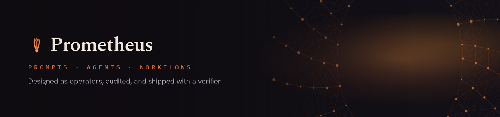
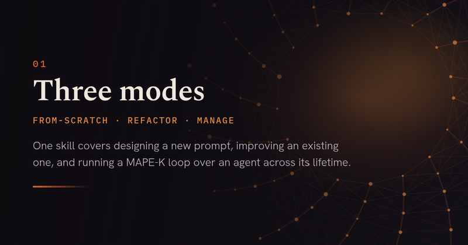
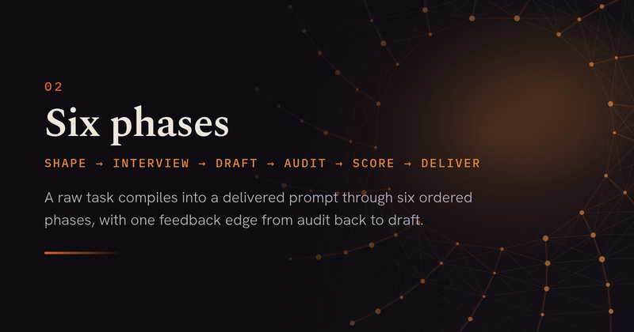
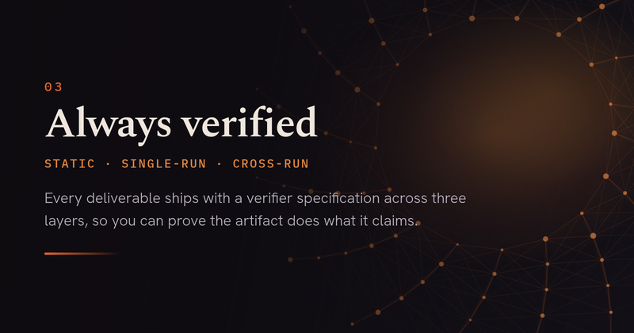
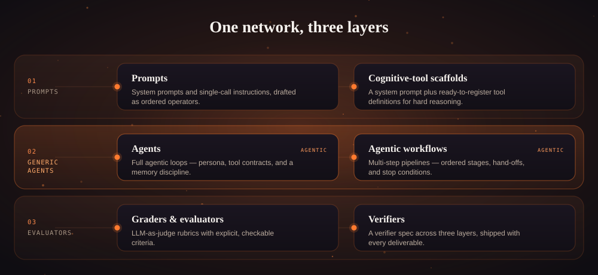
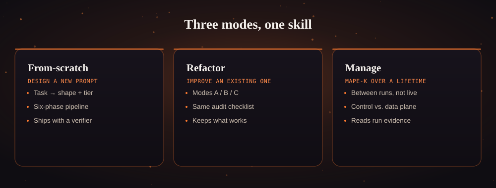
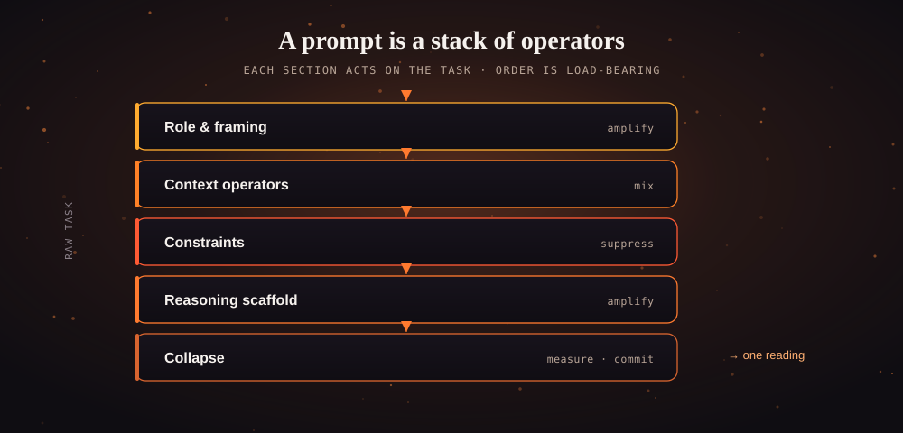
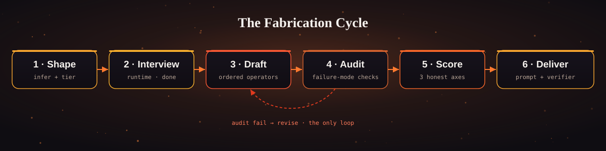

<div align="center">



<h1>Prometheus</h1>

**A meta-prompting framework for agentic systems.**
It designs, audits, and *maintains* prompts, agents, and agentic workflows —
each shipped with a verifier that proves it works.

<p>
  <a href="LICENSE"></a>
  <a href="https://github.com/Samuele95/prometheus/releases/latest"></a>
  <a href="https://github.com/Samuele95/prometheus/stargazers"></a>
  
  
</p>

<p>
  <a href="#-quick-start"><b>Quick start</b></a> &nbsp;·&nbsp;
  <a href="https://samuele95.github.io/prometheus/">Website</a> &nbsp;·&nbsp;
  <a href="https://samuele95.github.io/prometheus/documentation-forge.html">Documentation</a> &nbsp;·&nbsp;
  <a href="https://github.com/Samuele95/prometheus/releases/latest/download/prometheus-skill.zip">Download the skill</a>
</p>

</div>

> [!NOTE]
> **A prompt is an operator, not a key.** You don't *retrieve* the right answer by
> finding magic words — you *construct* it, section by justified section, the way you
> build a circuit. Agents and workflows are just the largest things you build that way.

<div align="center">
  
  
  
</div>

---

## Contents

<table>
<tr>
<td valign="top">

- [⚡ Quick start](#-quick-start)
- [What it is](#what-it-is)
- [What it builds](#what-it-builds)
- [Three modes](#three-modes)

</td>
<td valign="top">

- [Core idea: prompts as operators](#core-idea-prompts-as-operators)
- [The Fabrication Cycle](#the-fabrication-cycle)
- [Verification](#verification)

</td>
<td valign="top">

- [Install](#install)
- [Repository layout](#repository-layout)
- [Documentation](#documentation)
- [License](#license)

</td>
</tr>
</table>

---

## ⚡ Quick start

**1. Get the skill** — [download the zip](https://github.com/Samuele95/prometheus/releases/latest/download/prometheus-skill.zip), or clone:

```bash
git clone https://github.com/Samuele95/prometheus.git
```

**2. Drop it on your agent's skill search path** (Claude Code shown; keep
`references/`, `operators/`, `templates/`, `manage/` intact):

```bash
cp -a prometheus ~/.claude/skills/prometheus
```

**3. Describe what you need — a prompt, an agent, or a workflow.** No build step,
no dependencies. The host auto-routes to Prometheus the moment it sees the intent:

```text
build an agent that triages support tickets and files them with our tools
```

> [!TIP]
> Using Gemini instead? Prometheus ships a filesystem-free **Gem port** — jump to
> [Install → Gemini Gem](#gemini-gem).

## What it is

Prometheus is a portable **agent skill** and a build-time engine for **agentic
systems**. Give it an intent and it engineers the artifact end to end — a prompt, a
**full agent**, or a **multi-step workflow** — audits it, scores it, and ships it with
a verifier. It runs entirely at **build time**: it designs, audits, refactors, and
*maintains* the things your agents are made of. It does not sit in your request path
at runtime.

It is deliberately **not prompt-only**. A system prompt is the smallest thing it
produces; a self-adaptive agent kept healthy across its lifetime is the largest.

It's one always-loaded `SKILL.md` router (~22&nbsp;KB) plus a corpus of companion
knowledge files pulled into context only at the step that needs them. No build step,
no dependencies, MIT — and there's a **Gemini Gem** port for a filesystem-free runtime.

## What it builds

The same operator model compiles into whatever the task needs. The six outputs stack
into three layers, the way a network stacks: raw instructions in, **agents in the
middle**, judgement on the way out.

<div align="center">
  
</div>

<table>
<tr><th align="left">Layer</th><th align="left">Output</th><th align="left">What it is</th></tr>
<tr><td rowspan="2"><b>01 · Prompts</b></td><td><b>Prompts</b></td><td>System prompts and single-call instructions, drafted as ordered operators and scored before delivery.</td></tr>
<tr><td><b>Cognitive-tool scaffolds</b></td><td>For hard multi-step reasoning: a system prompt plus ready-to-register tool definitions for your tool-calling runtime.</td></tr>
<tr><td rowspan="2"><b>02 · Agents &amp; workflows</b></td><td><b>Agents</b></td><td>Full agentic loops — persona, tool contracts, and a memory discipline — designed to run over many turns against real tools.</td></tr>
<tr><td><b>Agentic workflows</b></td><td>Multi-step pipelines and orchestration blueprints — ordered stages, hand-offs, and stop conditions — wiring several prompts into one system.</td></tr>
<tr><td rowspan="2"><b>03 · Evaluators</b></td><td><b>Graders &amp; evaluators</b></td><td>LLM-as-judge rubrics with explicit, checkable criteria — for when the task is to score, not to generate.</td></tr>
<tr><td><b>Verifiers</b></td><td>Every deliverable ships with a verifier spec across three layers, so you can prove the artifact does what it claims.</td></tr>
</table>

## Three modes

<div align="center">
  
</div>

| Mode | Use it to |
|---|---|
| **From-scratch** | Design a new prompt, agent, or workflow from a description. |
| **Refactor** | Improve an existing prompt/agent — audit-only (A), surgical diff (B), or wholesale rewrite (C). |
| **Manage** | Keep a **deployed agent** healthy over its lifetime with a MAPE-K loop. |

### Manage mode — a MAPE-K loop over a live agent

The mode that makes Prometheus more than a prompt tool. Point it at a managed-agent
package — a directory that *is* the agent's identity — and it runs a **Monitor →
Analyze → Plan → Execute** loop over it, always *between* runs, never driving it live:

| Step | What it does |
|---|---|
| **Monitor** | Reconstructs the behaviour the current prompt actually induces, from recent run evidence. |
| **Analyze** | Keeps candidate adaptations in weighted superposition and prunes the ones a ledger says already regressed. |
| **Plan** | Collapses to a single edit. |
| **Execute** | Applies it at a controlled lifecycle seam — write-ahead-logged and reversible by snapshot. |

> [!IMPORTANT]
> Strict **control-plane / data-plane split**: the prompt, tools, and knowledge files
> are manager-owned (the control plane it rewrites); the agent's own `memory/` is
> agent-owned (the data plane) and is read as a probe, **never** hand-edited. It reads
> run evidence and rewrites the agent — it never sits in the request path.

## Core idea: prompts as operators

Every section of a prompt is an **operator** acting on the task — it amplifies some
readings of the intent, suppresses others, and mixes the rest. Order is load-bearing:
a later operator's meaning depends on the reading an earlier one already selected. One
operator is set apart — **Collapse**, the measurement act, where the prompt commits to
a single interpretation. Agents and workflows are assembled from the same operators,
which is why the same discipline scales from a one-line instruction to a
lifecycle-managed system.

<div align="center">
  
</div>

## The Fabrication Cycle

From-scratch design compiles a raw task into a delivered artifact across six ordered
phases. Data flows forward; a single feedback edge returns a failing audit from
Phase&nbsp;4 to Phase&nbsp;3 for revision — the only loop in the pipeline.

<div align="center">
  
</div>

| # | Phase | What it does |
|:-:|-----------|-------------------------------------------------|
| 1 | Shape     | Infer the structural shape and strength tier |
| 2 | Interview | Recover the runtime and the definition of done |
| 3 | Draft     | Lay out the artifact as ordered operators |
| 4 | Audit     | Check the draft against the failure-mode checklists |
| 5 | Score     | Rate token economy, task fit, operator coherence |
| 6 | Deliver   | Ship the artifact with a verifier |

## Verification

Every artifact — prompt, agent, or workflow — ships with a verifier defined across
three layers: **static** properties of the artifact, **single-run** properties of one
output or trajectory, and **cross-run** properties visible only across many. Cross-run
is where agent regressions hide. A scaffold-to-trigger list records which capability is
actually tested versus merely source-backed.

For hard multi-step reasoning on a tool-calling runtime, Prometheus can emit a
cognitive-tools scaffold: a system prompt plus four tool definitions you register in
your own runtime.

## Install

Prometheus is one folder containing a `SKILL.md` with valid frontmatter. How you make
it discoverable depends on your runtime.

<details open>
<summary><b>Agentic runtimes</b> — Claude Code, OpenAI Codex, opencode, Cursor, …</summary>

<br>

Clone the repository and copy it onto your host's skill search path, keeping
`references/`, `operators/`, `templates/`, and `manage/` intact:

```bash
git clone https://github.com/Samuele95/prometheus.git
cp -a prometheus ~/.claude/skills/prometheus
```

`gem/`, `docs/`, and `.github/` are packaging, not corpus — the skill works with or
without them. There is no build step and no dependencies. The host reads the frontmatter
`description` and routes to the skill whenever it sees the intent — "write a prompt for
X", "build an agent", "design an agentic workflow", "grade these outputs", "fix my
prompt", or "manage this agent".

</details>

<details>
<summary><b>Gemini Gem</b> — filesystem-free port</summary>

<br>

Gemini has no filesystem and caps a Gem's knowledge base at ten files, so the framework
is **ported**, not copied: the twenty-four source files are consolidated into one
standing instruction plus eight knowledge files. See
[`gem/GEM-DESCRIPTION.md`](gem/GEM-DESCRIPTION.md) for the port details, features, and
limitations, and [`gem/en/setup-guide.md`](gem/en/setup-guide.md) to install.

In short: create a Gem named **Prometheus**, paste `gem/en/gem-instructions.md` into its
instruction field, upload the eight `gem/knowledge/*.txt` files **without renaming them**
(retrieval is selective, so the wiring table's filenames are load-bearing), and start
describing your task.

</details>

## Repository layout

```text
SKILL.md         # always-loaded router: mode detection + from-scratch procedure
references/      # shared knowledge (quantum principles, shapes, reasoning, …)
operators/       # the operator catalog
templates/       # interview branches, output templates
manage/          # manage-mode MAPE-K loop, operators, and replay-verifier.py
gem/             # the Gemini Gem port (+ GEM-DESCRIPTION.md)
docs/            # the documentation site (GitHub Pages)
assets/          # figures, banner, social preview
CITATIONS.md     # every technique traced to a primary source
```

The only script, `manage/replay-verifier.py`, imports nothing outside the Python
standard library. There is no build step and nothing to install.

## Documentation

The full documentation — the operator model, the seven shapes, the three modes, the
manage-mode loop, the audit checklist, and per-runtime install guides — is published
from `docs/`:

<div align="center">

**→ [Read the documentation](https://samuele95.github.io/prometheus/documentation-forge.html) ←**

</div>

It includes an interactive source browser that shows the exact corpus for the runtime
you pick, so you can read what the model will read before installing.

## License

[MIT](LICENSE). Every technique is traced to a primary source in
[CITATIONS.md](CITATIONS.md).

<div align="center"><sub>Built by Samuele Stronati · <a href="https://samuele95.github.io/prometheus/">samuele95.github.io/prometheus</a></sub></div>
